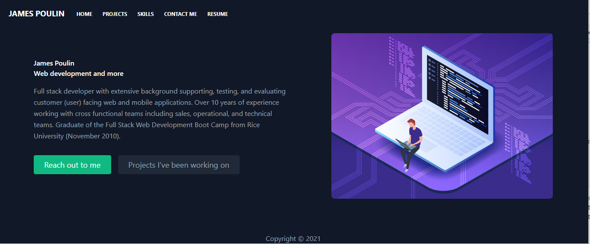

# Professional Portfolio using React

Thanks for taking the time to look at my professional portfolio.  

I am a Full stack developer with extensive background supporting, testing, and evaluating customer (user) facing web and mobile applications.  Over 10 years of experience simultaneously collaborating with sales, operational, and technical teams.  Earning a certificate in Full Stack Web Development from the Rice University Coding Boot Camp (expected completion Nov. 2021).

Here I will will showcase the latest project I am using to further develop my skills.

## Deployed site

Click the link below to the deployed site:  
https://jpoulin-react-portfolio.netlify.app/

